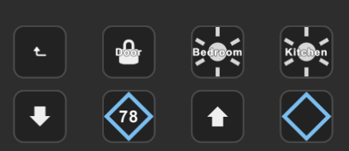
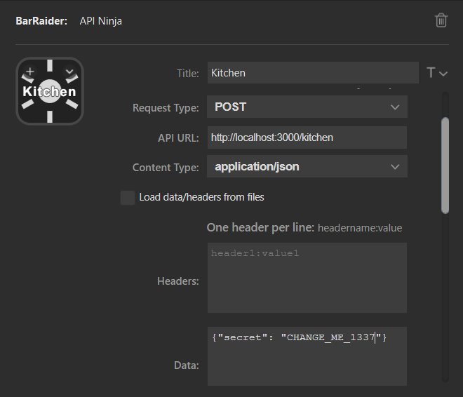
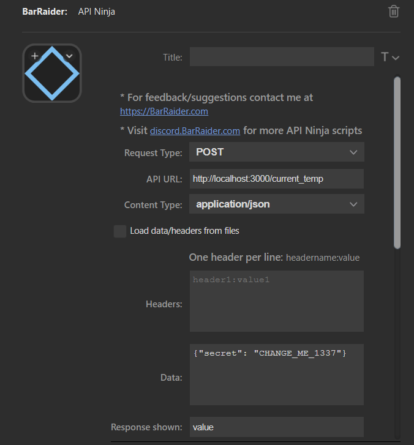
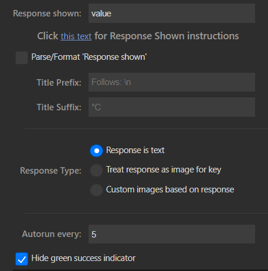

## Home Control API for Stream Deck

Home Control is a simple Python API designed to run inside a Docker container, providing an interface for your Stream Deck to control various smart home devices via the Bar Raider API Ninja plugin. Specifically, it targets SmartRent devices, utilizing a third-party/unofficial [SmartRent API](https://github.com/ZacheryThomas/smartrent.py) for the operations.

### Prerequisites

If you plan on using Home Control in a Docker container, all you'll need is Docker (and Stream Deck with the Bar Raider API Ninja Plugin) to get started. Otherwise, you'll need the following pre-reqs:

- Python 3
  - Dependencies: smartrent.py flask asgiref

### Setup

The following environment variables should be set:
- `SECRET`: A secret key for secure access. Basic "security" so random POST requests to the endpoint won't unlock the door. Can be set to whatever you want as long as you also update the API call being made to Home Control.
- `EMAIL`: Email for SmartRent login.
- `PASSWORD`: Password for SmartRent login.
- `PORT`: Port number on which the Home Control API should run.

### API Endpoints

- POST `/<path:room>` - control various devices based on the room/path provided.
  - POST body should be JSON containing `{secret: "SECRET_ENV_VAR"}`
  - Valid paths: kitchen, bedroom, door, toggle_thermostat, current_temp, increase_temp, decrease_temp.

### Usage

After configuring your environment variables, start up docker-compose/run the python script.

### Stream Deck

I have a dedicated page on my Stream Deck for Home Control that looks like this.

For actions such as turning on the kitchen light, I have it configured like so:

For actions like current_temp, I make use of the `Response shown` field to show the current temp/pending temp. I also have it autorun every 5 seconds in order to fetch the latest temperature. Feel free to adjust this to your liking.

